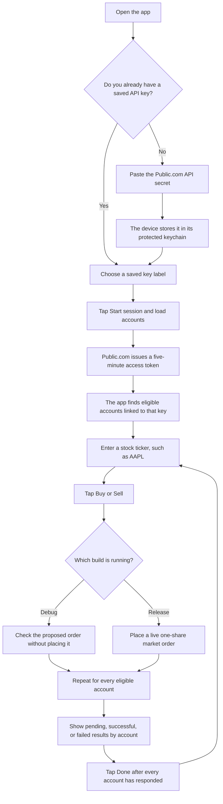

# Publics Trading Interface

Publics Trading Interface is a desktop and mobile app for placing the same stock order across the eligible Public.com accounts connected to one API key.

The app is intended for people who manage more than one supported Public.com brokerage account and want to see the result for each account in one place.

> [!CAUTION]
> A Release build places real market orders. Pressing Buy or Sell sends an order to every eligible account loaded for the selected API key. There is no final confirmation screen. Debug builds use Public.com's preflight check instead and do not place the order.

## What the app does

| Function | What it means for the user |
| --- | --- |
| Stores API keys securely | You paste a Public.com API secret once. The secret is saved in the device's protected keychain rather than displayed in the app. |
| Supports more than one API key | Saved keys appear as simple labels such as `PublicsApiKey0` and `PublicsApiKey1`. You can choose which key to use for a session. |
| Starts a short session | The selected key is exchanged for a Public.com access token that lasts five minutes. Trading controls appear only after the session starts. |
| Finds connected accounts | The app loads the eligible accounts connected to the selected key. It supports standard brokerage, Roth IRA, and traditional IRA accounts. |
| Sends one order to every eligible account | A Buy or Sell action is sent separately to each loaded account. The order is always for one share of the entered stock symbol. |
| Shows every account result | A results screen lists each account as waiting, successful, or failed. Public.com's response or error is shown for each account. |
| Handles slow requests | If Public.com does not return an order result within 30 seconds, that account is marked as failed. |
| Lets you switch keys | You can end the current session, return to the saved-key list, and start another session with a different key. |
| Adapts to different screen sizes | The interface rearranges itself for phones, tablets, and desktop windows. |

## How a session flows

The same flow as a short list:

1. Save or select a Public.com API key.
2. Start a five-minute session.
3. Wait while the app loads the supported accounts connected to that key.
4. Type a stock ticker.
5. Tap Buy or Sell.
6. Review the result for every account.
7. Tap Done to return to the trading screen, or switch keys to start a different session.

## Order details

Every submitted order currently uses these fixed settings:

- One share
- Stock/equity
- Market order
- Day order, which expires at the end of the trading day if it does not fill
- Order validation enabled
- All eligible accounts linked to the selected API key

The app does not currently offer a quantity selector, limit prices, stop orders, extended-hours settings, or a way to choose only some of the loaded accounts.

## Supported account types

The app includes these Public.com account types when it prepares an order:

- Standard brokerage
- Roth IRA
- Traditional IRA

Other account types are skipped.

## Debug and Release behavior

| Build | Buy button | Sell button |
| --- | --- | --- |
| Debug | Runs a preflight check only | Runs a preflight check only |
| Release | Places a live market order | Places a live market order |

A preflight asks Public.com whether an order would be accepted and can return an estimated value and fee. It does not place the order.

## Security and privacy

- API secrets are stored in the operating system's protected keychain.
- The app shows key labels after saving, not the secret values.
- Insecure keychain fallback is disabled.
- Switching keys clears the previous account list and authorization state before the new session begins.
- The app talks directly to Public.com's API over HTTPS.

Never share an API key, screenshot it, or commit it to this repository.

## What the results screen means

Each loaded account gets its own result row:

- `Pending` means the app is waiting for Public.com.
- `Trade success` means Public.com accepted the preflight or live order request.
- `Trade failed` means Public.com rejected the request, a network error occurred, or the request timed out.

The Done button stays disabled until every account has either succeeded or failed. Read every row before leaving the results screen.

## Current limitations

- The ticker is entered manually. The stock-search component exists in the project but is not connected to the main trading screen yet.
- The app does not display balances, positions, buying power, or the number of shares available to sell.
- Saved API keys cannot currently be renamed or deleted from the app.
- The five-minute countdown is maintained by the app and does not renew the session automatically.
- A Release order is sent as soon as Buy or Sell is pressed. There is no extra confirmation step.
- Successful submission means Public.com accepted the request. It does not guarantee that the market order has filled.

## Intended platforms

The project uses Qt 6 and is set up for macOS, iOS, Android, and Windows. Platform support still depends on having the required Qt tools, signing setup, and device permissions for the target system.

## Disclaimer

This project is an independent trading interface and is not financial advice. Review the source, test with a Debug build, and understand the account-wide behavior before using a Release build. You are responsible for every order sent through your Public.com account.
